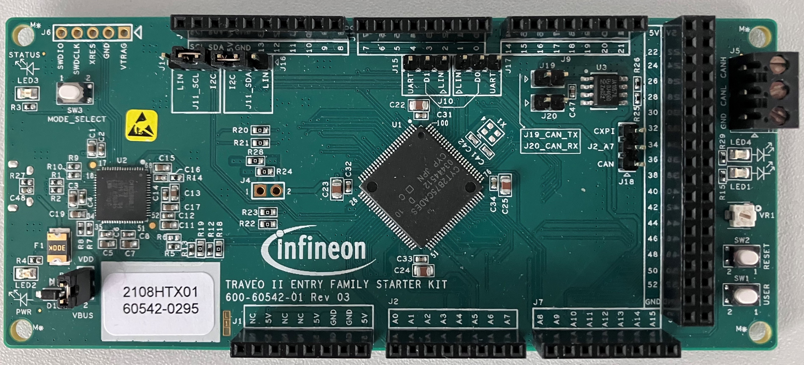

  

#  gpio-led-1-t2g-entry-starterkit
**Simple example. written in Rust, which shows an LED being controlled by a push button/switch.**

## Device  
The device used in this example is Traveo™ CYT2B75.

## Board  
The board used for testing is the Traveo™ II Entry Family Starter Kit.

## Scope of work  

## Introduction  

## Hardware setup  
This code example has been developed for the board CYTVII-B-E-1M-SK (raveo™ II Entry Family Starter Kit).

## Implementation

## Run and Test

## References
