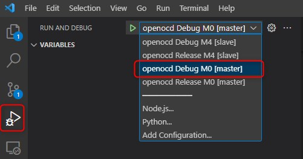
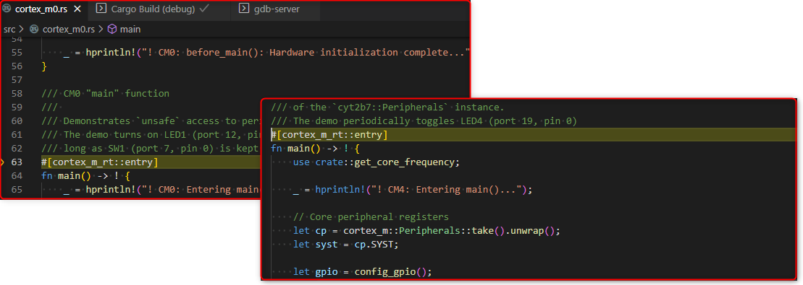
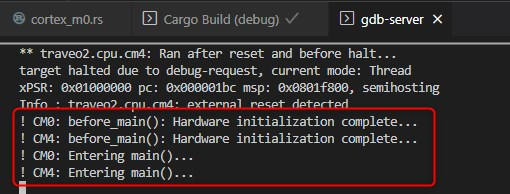

  

#  gpio-access-t2g-bodyentry-starterkit
**A simple, baremetal example, written in Rust, which toggles one LED periodically and the other based on the status of a switch**

## Device

The device used in this example is [TRAVEO™ T2G CYT2B75](https://www.infineon.com/cms/en/product/microcontroller/32-bit-traveo-t2g-arm-cortex-microcontroller/32-bit-traveo-t2g-arm-cortex-for-body/traveo-t2g-cyt2b7-series/). 

## Board

The board used for testing is the [TRAVEO™ II Body Entry Family Starter Kit](https://www.infineon.com/cms/en/product/evaluation-boards/cytvii-b-e-1m-sk/).

## Scope of Work

This tutorial demonstrates the usage of TRAVEO™ T2G Peripheral Access Crates (PACs) to access GPIO registers from both cores:
- From the startup core, CM0, LED1 is turned ON by default and is turned OFF whenever SW1 is pressed. All peripherals access is done using using _unsafe Rust_ (i.e. inside `unsafe` blocks)
- From the application core, CM4, LED4 is toggled periodically. All peripheral access is done using _safe Rust_

## Introduction

The TRAVEO™ CYT2B75 contains 2 ARM Cortex-M cores:  
1. The  _**startup core**_ is a Cortex-M0+, referred to as CM0 in the rest of this tutorial for brevity. It is responsible for initial HW setup and for enabling the _application core_
2. The _**application core**_ is a more performant Cortex-M4, referred to CM4 in the rest of this tutorial

The CM0 demo code...
- initializes it's own vector table
- initializes the vector table for the CM4 core
- starts the CM4 core
- sets up GPIO 12.2 as output for LED4 and GPIO 7.0 as input for SW1
- turns on LED4 and monitors SW1, turning off LED1 whenever SW1 is pressed

The CM4 demo code...
- initializes GPIO 19.0 as output for LED1
- sets up a delay source
- toggles LED1 periodically

This example demonstrates peripheral access using both safe and unsafe Rust. All peripheral access in CM0 is done using _unsafe Rust_, e.g. raw pointer dereferencing with no memory safety checks. All such accesses are enclosed in `unsafe` blocks. On the other hand, peripheral access from CM4 is done using _safe Rust_.

For the sake of simplicity, no mutual exclusion for peripheral access is implemented in this tutorial.

The Peripheral Access Crates used to access peripheral register are generated from TRAVEO™ T2G SVD file using the `svd2rust`. For more information about the `svd2rust` API, please refer to it's documentation and for details of TRAVEO™ peripheral registers, please refer to the appropriate Technical Reference Manual - links are provided in the __References__ section at the end.

## Hardware Setup

This code example has been developed for the board [TRAVEO™ II Body Entry Family Starter Kit](https://www.infineon.com/cms/en/product/evaluation-boards/cytvii-b-e-1m-sk/).


The development board is powered-on and debugged using a micro-USB cable connected to the PC. It comes with the __KitProg3__ debug interface, so no external debugger is needed.

## Development Environment

A list of all requirements is given below. For detailed steps please refer to the [setup instructions](https://github.com/Infineon/traveo-rs-user-guide/blob/main/setup-instructions/README.md).

- VSCode with the following extensions:
    - Cortex-Debug
    - rust-analyzer
- Rust toolchains:
    - stable-x86_64-pc-windows-gnu
- Rust Embedded Targets:
    - thumbv6m-none-eabi (Cortex-M0+)
    - thumbv7em-none-eabi (Cortex-M4)
- Rust tools:
    - cargo-binutils
    - cargo-generate
- Arm GNU Toolchain for Windows (arm-none-eabi-gdb)
- Python 2.7
- CypressAutoFlashUtility + OpenOCD
    - Included in the repository under the `traveo_debug` folder

## Implementation
**Third-party Crates**  

This example uses the following third party crates, which are declated in the [manifest file (*Cargo.toml*)](https://doc.rust-lang.org/cargo/reference/manifest.html):
- [cortex-m v0.7.5](https://crates.io/crates/cortex-m/0.7.5)
- [cortex-m-rt v0.7.0](https://crates.io/crates/cortex-m-rt/0.7.0)
- [cortex-m-semihosting v0.3.1](https://crates.io/crates/cortex-m-semihosting/0.3.1)
- [panic-halt v0.2.0](https://crates.io/crates/panic-halt/0.2.0)

**Peripheral Access Crate (PAC)**

A Peripheral Access Crate or PAC is a thin wrapper over direct hardware access to the device registers. For the TRAVEO™, we are using [svd2rust](https://crates.io/crates/svd2rust) with some custom post processing steps to generate the PAC. PACs for most TRAVEO™ are [available on crates.io](https://crates.io/search?q=traveo).
This example is for a TRAVEO™ CYT2B75 device, so the corresponding [cyt2b75](https://crates.io/crates/cyt2b7) crate is used.

The PAC provides the ability to access regiters both via the default *safe* Rust as well as `unsafe` Rust.

**Application Startup**

Cortex-M0+ is the startup core. For this demo, the `src/cortex_m0.rs` source file contains the the entire code for the startup core. The `cortex_m_rt::pre_init` attribute macro is used for the `before_main()` function to specify that it is called at the beginning of the reset handler. It is used to do the bare minimum initialization of the device i.e. initialization of the vector tables for both cores and starting the CM4 application core.

**CM0 Demo**

The `main()` function is the entry point for the CM0 core (specified by the `cortex_m_rt::entry` attribute macro). As explained above, the CM0 code sets up GPIO 12.2 as output for LED4 and GPIO 7.0 as input for SW1 and then toggles LED4 whenever SW1 is pressed  in an infinite loop.

In the CM0 demo code, only `unsafe` access is used, i.e. raw memory pointers to the hardware registers are used, for example:

- Getting a pointer to the GPIO register block:
```rust
    let gpio = &*pac::GPIO::PTR;
```

- Using the pointer to read the status of GPIO 7.0:
```rust
    if (*gpio).prt7.in_.read().in0().bit_is_clear() {
        // ...
    }
```

**CM4 Demo**

The `main()` function is the entry point for the CM4 core (specified by the `cortex_m_rt::entry` attribute macro). It sets up GPIO 19.0 as an output for LED1 and toggles it once every 250ms in an infinite loop. Safe register access is used here by taking ownership of the peripheral registers:

- Using `take()` to take ownership of the peripheral structure:
```rust
    let p = pac::Peripherals::take().unwrap();
    let gpio = p.GPIO;
```

- The GPIO can be written as follows:
```rust
    gpio.prt19.out_inv.write(|w| w.out0().bit(true));
```

**Semihosting**

Semihosting is available via the `hprintln` macro from the `cortex-m-semihosting` crate and can be used as follows:
```rust
    _ = hprintln!("! CM4: Entering main()...");
```

## Run and Test

The development board is powered-on and debugged using a micro-USB cable connected to the PC. It comes with the **KitProg3** debug interface, so no external debugger is needed. The Rust application is flashed and debugged using the CypressAutoFlashUtility and GDB + OpenOCD, respectively. The VSCode Cortex-Debug extension is used for debugging and the debugger is configured via `.vscode/launch.json`.

To start debugging, connect the micro-USB cable to the PC. From the VSCode Activity Bar, click `'Run and Debug'`, select the `'openocd Debug M0 [master]'` target and press `F5`.



Debugging and stepping through code should be possible now. Both CM0 and CM4 can be debugged independently.



The semihosting output can be seen in the GDB Server output:



# References
User guide for Rust for TRAVEO™ T2G devices:
- https://github.com/Infineon/traveo-rs-user-guide/blob/main/README.md

Rust blogs in the Infineon Developer Community:
- https://community.infineon.com/t5/tag/Rust/tg-p/board-id/Blogs

Embedded Rust:
- https://docs.rust-embedded.org/book/
- https://github.com/rust-embedded

TRAVEO™ T2G CYT2B7 Series
- https://www.infineon.com/cms/en/product/microcontroller/32-bit-traveo-t2g-arm-cortex-microcontroller/32-bit-traveo-t2g-arm-cortex-for-body/traveo-t2g-cyt2b7-series/

